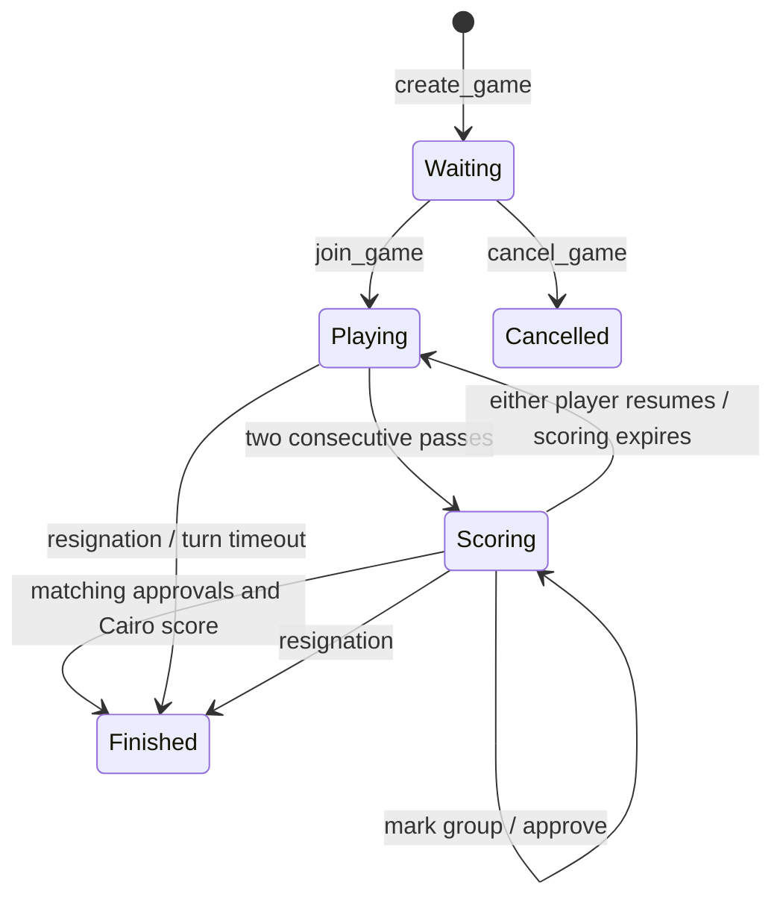

# Historical onchain reference

> **Status (2026-09-26):** the per-move onchain system described here was removed when Surround moved onto referee. Its code is at commit `2a56a00`.

This document describes the retained `surround-actions` implementation and its
original verification record. New Surround matches use `surround-channel`; see
[the project README](README.md) and [offchain protocol](OFFCHAIN_PROTOCOL.md).

# Surround contracts

Cairo / Dojo contracts for the onchain version of the Surround Go game.
Every placement, capture, pass, group marking, approval, and final result is
enforced by contracts. Players decide which groups are dead; Cairo counts area
only after both players approve the same proposal.

A separate [Sepolia Stwo benchmark](benchmarks/SEPOLIA_RESULTS.md) settled all
six recorded games using native SNIP-36 proofs and compared the gas with direct
scoring. Integrating that path into the Dojo game remains a separate step;
games currently score directly onchain.

## Build and test

Pinned toolchain: **Scarb 2.13.1**, **Sozo 1.8.6**, **Dojo 1.8.0**.
These versions match the Cairo/Dojo dependency family; the pins are intentional.
With the corresponding asdf plugins installed:

```sh
asdf install
sozo build
sozo test
scarb fmt --check
```

Run build and tests sequentially: they share Scarb's output directory. `sozo test`
uses the Dojo Cairo test harness; Scarb currently prints a deprecation notice for
that runner. No wallet or running node is needed for these tests.

Six [recorded-game regression fixtures](tests/fixtures/sgf/README.md) replay
1,177 moves from CGOS and KGS, then check settlement against their published
numeric scores. This includes a 19×19 game whose correct B+1.5 result requires
marking 34 dead stones. The original SGFs and checksummed provenance are included;
the test suite does not download games.

## Rules v1

- Board sizes: 9×9, 13×13, or 19×19. Points are zero-based row-major indices:
  `point = row * size + column`.
- The creator plays Black. White joins an open game or accepts an invitation.
  Black moves first. A player cannot occupy both seats.
- Captures use orthogonal connectivity and zero liberties. Opponent captures are
  resolved before checking the new group's liberties. Suicide is prohibited.
- **Positional superko:** a placement cannot reproduce any earlier board in that
  game. The initial empty board is included. Passes are exempt. History is kept
  across scoring disputes and resumed play.
- **Area scoring:** each remaining stone counts one point; each connected empty
  region bordered exclusively by one color counts for that color. Empty regions
  touching both colors, or neither color, are neutral. Captured stones do not add
  a separate prisoner bonus. Own enclosed eyes in seki count under these area
  rules; shared liberties remain neutral.
- Komi is nonnegative, chosen at creation, and immutable. Scores use half-point
  units: `komi_half = 13` means 6.5 points, `15` means 7.5. The allowed maximum is
  twice the number of intersections. Zero/integer komi can produce a draw.
- No automatic life/death adjudication, handicap, Japanese territory scoring,
  wagers, ratings, or offchain proof verifier is included in v1.

This is a specified Surround ruleset, not a claim of exact Japanese, Chinese,
AGA, or Tromp–Taylor tournament-rule compatibility.

## Scoring and disputes



Two passes open a new **scoring round** with all groups alive and no approvals.
Either player can mark an entire connected group dead or alive by selecting one
stone. Each actual change increments the **proposal revision** and clears both
approvals. A no-op marking is rejected. Markings never alter the played board.

Each approval specifies the game ID, scoring round, and revision. The stored
proposal also binds the exact board hash. A player can approve only once per
revision. The second matching approval computes and stores both scores and the
winner atomically. Both players may agree to remove any complete groups; the
contract does not judge their tactical assessment.

Either player may resume from scoring without the opponent's permission. The
original board and repetition history are preserved; proposed removals and
approvals are cleared. The opponent of the last player to pass moves next.
Further passes can start another scoring round; **four passes never force a
disputed score**. The finalized board also preserves the last played position;
the accepted proposal records which stones were excluded from the score.

### Time controls

Creation specifies a per-turn duration (60 seconds–30 days) and a scoring window
(60 seconds–7 days). The lobby expires after 24 hours. These are simple per-turn
clocks, not total-game clocks or byo-yomi.

- Joining starts Black's clock. Each legal placement or pass starts the next
  turn's clock.
- The second pass starts the fixed scoring window. Marking and approval do not
  extend it.
- At or after the scoring deadline, anyone may call `expire_scoring`. This resumes
  play with a fresh turn clock; silence never approves markings or awards a score.
- At or after an active turn deadline, anyone may call `claim_timeout`, awarding
  the game to the other player. The player whose clock expired cannot sneak in a
  move before someone claims the timeout.
- Transactions must arrive strictly before the relevant deadline to move, pass,
  mark, approve, join, or resign. Participants can still resume expired scoring.
- Time-based transitions require a transaction; the chain does not call these
  functions automatically. The UI or any keeper can submit them.

## Contract API

The Dojo system tag is `surround-actions`.

| Entry point | Purpose |
| --- | --- |
| `create_game(size, komi_half, invited_white, turn_seconds, scoring_seconds) -> felt252` | Create a game; use address zero for an open White seat. |
| `join_game(game_id)` | Join as White, accepting the immutable game settings. |
| `cancel_game(game_id)` | Creator cancels an unjoined game, or anyone expires it after 24h. |
| `play(game_id, expected_move, point)` | Place a stone; the move counter protects against stale transactions. |
| `pass(game_id, expected_move)` | Pass; also increments the move counter. |
| `mark_group(game_id, round, revision, point, dead)` | Mark the entire group at the point dead/alive. |
| `accept_score(game_id, round, revision)` | Approve the exact current proposal; second approval settles. |
| `resume_play(game_id, round)` | Either player rejects settlement and resumes play. |
| `expire_scoring(game_id, round)` | Permissionlessly resume after the scoring deadline. |
| `resign(game_id)` | Concede an active game to the opponent. |
| `claim_timeout(game_id)` | Permissionlessly finalize an expired active turn. |
| `get_game(game_id)` | Read players, rules, phase, counters, clocks, and result. |
| `get_board(game_id)` | Read the packed last played position. |
| `get_proposal(game_id)` | Read the latest proposal; consult phase before presenting it as active. |
| `preview_score(game_id, round, revision)` | Preview the current scoring proposal, without approving it. |

## Storage and structure

- `src/rules.cairo`: storage-independent board, capture, hashing, group selection,
  and scoring functions. Each color uses three `u128` limbs, covering 361 points.
  Limb/bit positions are `point / 128` and `point % 128`.
- `src/models.cairo`: `Game`, `Board`, `PositionHistory`, `ScoreProposal`, and the
  `GameUpdated` event. Game state is readable onchain and indexable through Torii.
- `src/systems/actions.cairo`: authorization, state transitions, clocks, superko,
  and settlement. Only this system receives write access to the five resources.
- `src/tests/`: pure rules fixtures and dispatched Dojo World integration tests.
  Ko fixtures seed a valid tactical position through test-only model writes;
  the capture and settlement scenarios use ordinary player actions.

The position commitment is a Poseidon hash of a domain tag, size, and the six
board limbs. Superko keys also include the game ID. Rules and komi live in the
immutable game settings; scoring proposals are scoped by game, round, revision,
and board commitment.

## Local deployment

Start a compatible Katana development node, then use its printed **development**
account with Sozo. `dojo_dev.toml` deliberately contains no private key.

```sh
katana --dev --dev.no-fee
# In another terminal, configure the development account via Sozo's environment
# or account flags, then:
sozo build
sozo migrate
```

For an automated transaction smoke test, Katana **1.7.1** is the tested local
version. Run a fresh local node with at least two accounts, keeping its startup
log outside the repository:

```sh
katana --dev --dev.no-fee --dev.accounts 2 > /tmp/surround-katana.log 2>&1
# In another terminal:
sozo build
python3 scripts/smoke_local.py --katana-log /tmp/surround-katana.log --migrate
```

The script reads the node's development keys without printing them, migrates the
world, and settles games on all three board sizes. Its 9×9 scenario also disputes
markings, resumes with the unchanged board, and captures the disputed group.
Use `--rpc-url http://127.0.0.1:PORT` for a separate local node; remote URLs are
rejected. Omit `--migrate` when the local manifest already matches the node.

The supplied migration grants resource-specific writers. Dojo world/resource
owners retain administrative and upgrade authority: a `rules_version` field
does not itself make upgradeable contracts immutable. Freeze or explicitly
govern those privileges before deploying a competitive production world.

This implementation has no external callbacks, payments, or prover dependency.
Offchain proofs could later reuse the pure scorer, provided an onchain verifier
binds the exact game state and approved removals. Test-runner gas figures are
execution estimates, not quoted Starknet transaction fees.

## Verification record

Validated locally with the pinned toolchain and Katana 1.7.1:

- `sozo build` and `scarb fmt --check` pass.
- `sozo test --print-resource-usage`: **50 passed, 0 failed**. Coverage includes
  capture-before-suicide, multi-group captures, board boundaries, all board sizes,
  a 288-stone capture on 19×19, scoring witnesses, superko across disputes,
  authorization, stale approvals, game isolation, and deadline boundaries, plus
  six complete recorded games replayed through the public contract API.
- The fixture generator independently verifies all six SGFs using sgfmill 1.1.1;
  generated Cairo data matches the source records and published results.
- Local migration declared and registered all resources, applied the five
  resource-specific writer permissions, and initialized the actions system.
- `scripts/smoke_local.py` completed its 9×9 dispute/capture/settlement sequence
  and settled 13×13 and 19×19 games using signed transactions from two accounts.
- For the smoke test's sparse boards, the second approval (including scoring)
  consumed 119,365,440 L2 gas on 13×13 and 237,405,440 on 19×19 according to local
  Katana receipts. These are fixture-specific measurements on that node version,
  not worst-case bounds or production fee estimates.

The Dojo game has not been deployed to a public network or independently audited.
The separate [native scoring harness](benchmarks/SEPOLIA_RESULTS.md) has completed
real Sepolia proof settlement. [Move and complete-game cost measurements](benchmarks/MOVE_COSTS.md)
compare the current onchain implementation with the opportunity for whole-game proofs.
